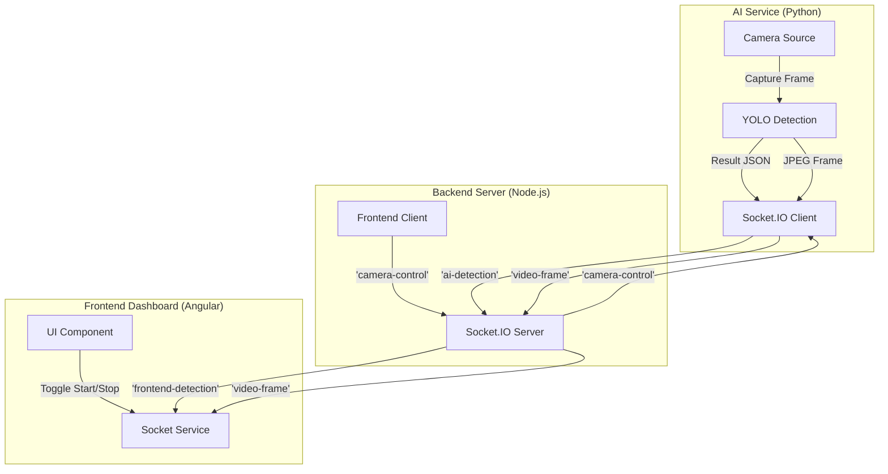

# Drive Mate - Real-Time AI Driving Assistant

## 🏗️ System Architecture

The system is built using a **Microservices-style Architecture** with three main components communicating via **Socket.IO**.



## 🔄 Data Connection Flow

1.  **Initialization**:
    *   **Backend** starts on port `3000` waiting for connections.
    *   **Frontend** connects to Backend.
    *   **Python AI** connects to Backend as a client.

2.  **Control Flow (Start Camera)**:
    *   User clicks **"▶️ Start Camera"** on Frontend.
    *   Frontend emits `camera-control: { command: 'start' }`.
    *   Backend relays this event to Python.
    *   Python sets `is_active = True` and begins the processing loop.

3.  **Data Flow (Streaming)**:
    *   **Video**: Python captures frame -> Encodes to JPEG Base64 -> Emits `video-frame`.
    *   **AI**: Python runs YOLO inference -> Detects objects -> Emits `ai-detection` (JSON).
    *   **Backend**: Receives events and immediately broadcasts them to the Frontend.
    *   **Frontend**: Updates the `` src with the video frame and displays alerts if signs are detected.

## 🛠️ Components & Technologies

### 1. Backend Service (`/Backend`)
*   **Tech**: Node.js, Express, Socket.IO.
*   **Role**: Central communication hub (Signaling Server).
*   **Key File**: `server.js`.
*   **Events**:
    *   `connection`: Handle new clients.
    *   `ai-detection`: Relay detection data.
    *   `video-frame`: Relay video stream.
    *   `camera-control`: Relay start/stop commands.

### 2. Frontend Application (`/Frontend`)
*   **Tech**: Angular 18+, TypeScript, Socket.IO Client.
*   **Role**: User Interface for monitoring and control.
*   **Key Files**:
    *   `src/app/services/socket.service.ts`: Manages Socket connection.
    *   `src/app/app.ts`: Component logic for state and display.
    *   `src/app/app.html`: Dashboard layout.

### 3. AI Detection Service (`/yolo-traffic2`)
*   **Tech**: Python 3.10+, OpenCV, Ultralytics YOLO, Python-SocketIO.
*   **Role**: Computes vision tasks.
*   **Key File**: `yolo_detect4.py`.
*   **Features**:
    *   Runs local YOLO inference.
    *   Encodes video frames to Base64 (optimised for web streaming).
    *   Text-to-Speech (TTS) for audio alerts.
    *   Smart priority logic (Danger > Prohibitory > Mandatory).

## 🚀 How to Run

**Step 1: Start Backend**
```bash
cd Backend
npm start
# Output: Example app listening on port 3000
```

**Step 2: Start Frontend**
```bash
cd Frontend
ng serve
# Open browser at http://localhost:4200
```

**Step 3: Start AI Service**
```bash
cd yolo-traffic2
python yolo_detect4.py --model bestDetectTrafficSign_ncnn_model --source 0
# Output: Camera initialized. Waiting for START command...
```

**Step 4: Operate**
1.  Go to the Frontend (`http://localhost:4200`).
2.  Click **"Start Camera"**.
3.  View live feed and detections.
